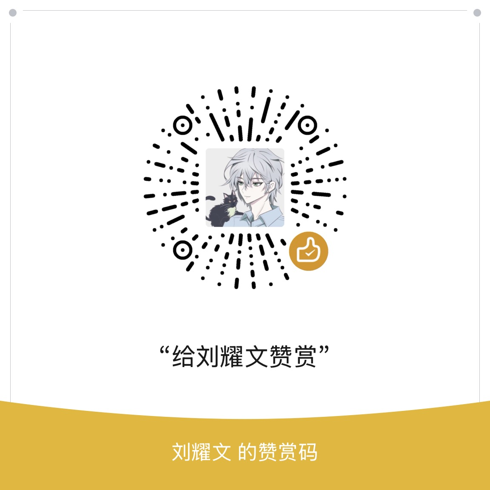

### Hi there 👋<h2> I'm Yaowen Liu</h2>

<!--

-->

### 👨🏻 About Me

- 🤔 &nbsp; I'm super curious about all the cool new stuff happening in tech,
  and I'm always keeping up with the latest trends. For me, programming isn't
  just about skills—it's a way to excites me.

- 🎓 &nbsp; Information and communication Engineering

- 📰 &nbsp; https://liuyaowen.cn/

### 🛠 Tech Stack

- 💻 &nbsp; Python | Java | GO | C | HTML | CSS | JS  

- 🌐 &nbsp; Vue | React | Uniapp | NextJS | Remix 

- 🛢 &nbsp; Spring ALL 

- 🖥 &nbsp; Guitar  

### 🛠 To Learn 2025

- 🔧 &nbsp; Dubbo's Ecology | Electron  | K8S Ecology

<!-- BEGIN_GITHUB_STATS -->

## 我的GitHub统计

<table>
  <tr>
    <td align="center" colspan="4">
      
      
    </td>
  </tr>
  <tr>
    <td align="center">
      
    </td>
    <td align="center">
      
    </td>
    <td align="center">
      
    </td>
    <td align="center">
      
    </td>
  </tr>
  <tr>
    <td align="center">
      
    </td>
    <td align="center">
      
    </td>
    <td align="center">
      
    </td>
    <td align="center">
      
    </td>
  </tr>
  <tr>
    <td align="center">
      
    </td>
    <td align="center">
      
    </td>
    <td align="center">
      
    </td>
    <td align="center">
      
    </td>
  </tr>
  <tr>
    <td align="center">
      
    </td>
    <td align="center">
      
    </td>
    <td align="center">
      
    </td>
    <td align="center">
      
    </td>
  </tr>
</table>

📅 统计更新于: 2025/08/23

<!-- END_GITHUB_STATS -->
想拥有同款卡片吗? 看这里 👉 https://github.com/OpenAISpace/star-track-action

### 📰 Blog posts

<!-- BLOG-POST-LIST:START -->
- [Spring 与 MyBatis 内部工具类大全](https://liuyaowen.cn/posts/default/20250818)
- [Java Stream 业务操作手册](https://liuyaowen.cn/posts/default/20250813)
- [深入理解SpringCloud Bootstrap启动机制](https://liuyaowen.cn/posts/codenotes/202507241)
- [《Dispersive Loss：重新审视表征学习中的对比损失》](https://liuyaowen.cn/posts/machinelearning/202506162)
- [构建LLM代理：为什么“多代理”架构往往是坑？](https://liuyaowen.cn/posts/default/202506131)
- [Beyond the Blur: A Deep Dive into a Custom SVG Glass Effect vs. Apple&#39;s Liquid Glass](https://liuyaowen.cn/posts/default/202506121)
- [Kotlin 备忘录](https://liuyaowen.cn/posts/default/202506091)
- [浅尝 Reactor 框架：响应式编程](https://liuyaowen.cn/posts/codenotes/202506061)
- [快速部署 Kubernetes、Harbor 和 Web 服务的教程](https://liuyaowen.cn/posts/default/202505121)
- [模型上下文协议&lpar;MCP&rpar;深度解析：规范、实践与示例](https://liuyaowen.cn/posts/default/202504281)
<!-- BLOG-POST-LIST:END -->

### ⚡️ Recent Activity

<!--START_SECTION:activity-->
1. 🎉 Merged PR [#55](https://github.com/OpenAISpace/ai-trend-publish/pull/55) in [OpenAISpace/ai-trend-publish](https://github.com/OpenAISpace/ai-trend-publish)
2. 🗣 Commented on [#5](https://github.com/OpenAISpace/ai-navigation/issues/5#issuecomment-2955377459) in [OpenAISpace/ai-navigation](https://github.com/OpenAISpace/ai-navigation)
3. 🔒 Closed issue [#9](https://github.com/bcmi/SSP-AI-Generated-Image-Detection/issues/9) in [bcmi/SSP-AI-Generated-Image-Detection](https://github.com/bcmi/SSP-AI-Generated-Image-Detection)
4. 🔒 Closed issue [#36](https://github.com/OpenAISpace/ai-trend-publish/issues/36) in [OpenAISpace/ai-trend-publish](https://github.com/OpenAISpace/ai-trend-publish)
5. 🗣 Commented on [#4](https://github.com/OpenAISpace/ai-navigation/issues/4#issuecomment-2924963901) in [OpenAISpace/ai-navigation](https://github.com/OpenAISpace/ai-navigation)
6. 💪 Opened PR [#52](https://github.com/OpenAISpace/ai-trend-publish/pull/52) in [OpenAISpace/ai-trend-publish](https://github.com/OpenAISpace/ai-trend-publish)
7. 🔒 Closed issue [#38](https://github.com/OpenAISpace/ai-trend-publish/issues/38) in [OpenAISpace/ai-trend-publish](https://github.com/OpenAISpace/ai-trend-publish)
8. 🚀 Published release [0.1.3](https://github.com/OpenAISpace/flow-engine/releases/tag/0.1.3) in [OpenAISpace/flow-engine](https://github.com/OpenAISpace/flow-engine)
9. 🚀 Published release [0.1.3](https://github.com/OpenAISpace/flow-engine/releases/tag/0.1.3) in [OpenAISpace/flow-engine](https://github.com/OpenAISpace/flow-engine)
10. 🚀 Published release [0.1.3](https://github.com/OpenAISpace/flow-engine/releases/tag/0.1.3) in [OpenAISpace/flow-engine](https://github.com/OpenAISpace/flow-engine)
<!--END_SECTION:activity-->

### 🤝🏻 Connect with Me

### 🎁 赞赏支持

如果我的项目对您有帮助，欢迎赞赏支持！

